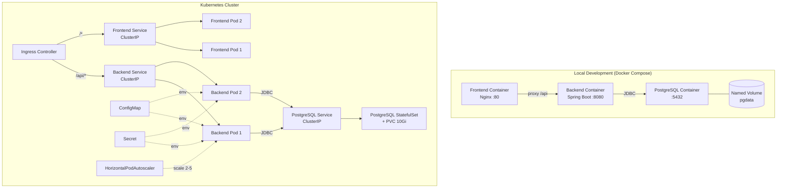

# Design Document: Docker, Kubernetes & PostgreSQL

## Overview

This design provides containerization, orchestration, and production database support for InsightHub. The solution introduces:

1. **Docker images** — Multi-stage Dockerfiles for both Backend (Spring Boot JAR on Eclipse Temurin JRE 17) and Frontend (Vite build served via Nginx Alpine)
2. **Docker Compose** — A local development stack orchestrating Backend, Frontend, and PostgreSQL with health checks and named volumes
3. **PostgreSQL integration** — A Spring profile (`postgres`) that switches the Backend from H2 to PostgreSQL, leveraging existing Flyway migrations
4. **Kubernetes manifests** — Namespace, Deployments, StatefulSet, Services, Ingress, ConfigMap, Secret, HPA, and health probes for cluster deployment

The design prioritizes simplicity, reproducibility, and alignment with the existing project conventions (Maven wrapper, pnpm, Flyway migrations, Spring profiles).

## Architecture



### Directory Structure

```
insighthub/
├── docker/
│   ├── backend/
│   │   └── Dockerfile
│   ├── frontend/
│   │   ├── Dockerfile
│   │   └── nginx.conf
│   └── docker-compose.yml
├── k8s/
│   ├── namespace.yaml
│   ├── configmap.yaml
│   ├── secret.yaml
│   ├── postgres-statefulset.yaml
│   ├── postgres-service.yaml
│   ├── backend-deployment.yaml
│   ├── backend-service.yaml
│   ├── frontend-deployment.yaml
│   ├── frontend-service.yaml
│   ├── ingress.yaml
│   └── backend-hpa.yaml
├── backend/
│   └── src/main/resources/
│       ├── application.yml          (existing — H2 default)
│       └── application-postgres.yml (existing — enhanced)
└── ...
```

## Components and Interfaces

### 1. Backend Dockerfile (`docker/backend/Dockerfile`)

**Design Decision:** Multi-stage build using Eclipse Temurin images (official OpenJDK distribution recommended by Spring).

| Stage | Base Image | Purpose |
|-------|-----------|---------|
| Build | `eclipse-temurin:17-jdk` + Maven wrapper | Compile source, run `mvn package -DskipTests` |
| Runtime | `eclipse-temurin:17-jre-alpine` | Run the fat JAR (~250 MB final image) |

Key design choices:
- Use the Maven wrapper (`./mvnw`) already in the project instead of installing Maven in the image
- Copy `pom.xml` first to leverage Docker layer caching for dependency downloads
- Use Alpine-based JRE to minimize image size (target < 400 MB)
- Run as non-root user (`appuser`) for security
- Expose port 8080
- Set `JAVA_OPTS` environment variable for JVM tuning at runtime
- Health check via `curl` to `/insighthub/actuator/health`

### 2. Frontend Dockerfile (`docker/frontend/Dockerfile`)

**Design Decision:** Multi-stage build separating pnpm build from Nginx serving.

| Stage | Base Image | Purpose |
|-------|-----------|---------|
| Build | `node:18-alpine` | `pnpm install --frozen-lockfile && pnpm build` |
| Runtime | `nginx:alpine` | Serve `/usr/share/nginx/html` (~30 MB final image) |

Key design choices:
- Install pnpm via corepack (Node 18+ ships with corepack)
- Copy `package.json` and `pnpm-lock.yaml` first for layer caching
- Custom Nginx config with:
  - `try_files` for SPA client-side routing (fallback to `index.html`)
  - `proxy_pass` for `/api` to Backend (host configurable via `BACKEND_HOST` env var, default `backend:8080`)
  - Gzip compression for static assets
- Expose port 80

### 3. Nginx Configuration (`docker/frontend/nginx.conf`)

```nginx
upstream backend {
    server ${BACKEND_HOST};
}

server {
    listen 80;
    root /usr/share/nginx/html;
    index index.html;

    # Gzip
    gzip on;
    gzip_types text/css application/javascript application/json image/svg+xml;

    # API proxy
    location /api/ {
        proxy_pass http://backend/insighthub/api/;
        proxy_set_header Host $host;
        proxy_set_header X-Real-IP $remote_addr;
        proxy_set_header X-Forwarded-For $proxy_add_x_forwarded_for;
        proxy_set_header X-Forwarded-Proto $scheme;
        proxy_connect_timeout 5s;
        proxy_read_timeout 30s;
    }

    # SPA fallback
    location / {
        try_files $uri $uri/ /index.html;
    }
}
```

**Design Decision:** Use `envsubst` at container startup to template the `BACKEND_HOST` variable into the Nginx config. This avoids hardcoding the backend address and allows the same image to work in both Docker Compose and Kubernetes.

### 4. Docker Compose (`docker/docker-compose.yml`)

Services:
- **postgres** — `postgres:16-alpine`, health check via `pg_isready`, named volume `pgdata`
- **backend** — Built from `docker/backend/Dockerfile`, depends on `postgres` (healthy), Spring profile set to `postgres`
- **frontend** — Built from `docker/frontend/Dockerfile`, depends on `backend`, `BACKEND_HOST=backend:8080`

Port mapping:
- Frontend → `3000:80` (matches current dev port)
- Backend → `8080:8080`
- PostgreSQL → `5432:5432` (for local tooling like pgAdmin)

Environment variables passed to Backend:
- `SPRING_PROFILES_ACTIVE=postgres`
- `SPRING_DATASOURCE_URL=jdbc:postgresql://postgres:5432/insighthub`
- `SPRING_DATASOURCE_USERNAME=insighthub`
- `SPRING_DATASOURCE_PASSWORD=insighthub`

### 5. PostgreSQL Profile Enhancement (`application-postgres.yml`)

The existing `application-postgres.yml` is enhanced with:
- Environment variable placeholders for all connection parameters using Spring's `${VAR:default}` syntax
- Connection pool configuration (HikariCP) — min 5, max 20
- Connection timeout and retry behavior via HikariCP settings

```yaml
spring:
  datasource:
    url: ${SPRING_DATASOURCE_URL:jdbc:postgresql://localhost:5432/insighthub}
    username: ${SPRING_DATASOURCE_USERNAME:insighthub}
    password: ${SPRING_DATASOURCE_PASSWORD:insighthub}
    driver-class-name: org.postgresql.Driver
    hikari:
      minimum-idle: ${DB_POOL_MIN:5}
      maximum-pool-size: ${DB_POOL_MAX:20}
      connection-timeout: 30000
      initialization-fail-timeout: 30000

  h2:
    console:
      enabled: false

  jpa:
    database-platform: org.hibernate.dialect.PostgreSQLDialect
```

**Design Decision:** The retry behavior (requirement 4.7) will be handled by HikariCP's `initializationFailTimeout` combined with Spring Boot's built-in datasource initialization retry. Setting `initialization-fail-timeout: 30000` (30 seconds) gives the pool time to establish connectivity. For the explicit 3-retry requirement, a custom `ApplicationRunner` bean will attempt connection verification with a retry loop (3 attempts, 5-second intervals) before the application fully starts.

### 6. Kubernetes Manifests

#### Namespace (`k8s/namespace.yaml`)
All resources scoped to `insighthub` namespace.

#### ConfigMap (`k8s/configmap.yaml`)
Non-sensitive configuration:
- `SPRING_PROFILES_ACTIVE: postgres`
- `SERVER_PORT: "8080"`
- `SPRING_FLYWAY_ENABLED: "true"`
- `SPRING_FLYWAY_LOCATIONS: classpath:db/migration`
- `SPRING_FLYWAY_BASELINE_ON_MIGRATE: "true"`

#### Secret (`k8s/secret.yaml`)
Sensitive data (placeholder values, base64-encoded):
- `SPRING_DATASOURCE_URL`
- `SPRING_DATASOURCE_USERNAME`
- `SPRING_DATASOURCE_PASSWORD`
- `APP_JWT_SECRET`

#### PostgreSQL StatefulSet (`k8s/postgres-statefulset.yaml`)
- Image: `postgres:16-alpine`
- Replicas: 1
- PVC: 10Gi `ReadWriteOnce`
- Resource requests: 256m CPU, 256Mi memory
- Resource limits: 1000m CPU, 1024Mi memory
- Liveness probe: `pg_isready`

#### Backend Deployment (`k8s/backend-deployment.yaml`)
- Replicas: 2 (default)
- `envFrom`: ConfigMap + Secret references
- Resource requests: 256m CPU, 512Mi memory
- Resource limits: 1000m CPU, 1024Mi memory
- Liveness probe: HTTP GET `/insighthub/actuator/health`, initial delay 60s, period 15s, timeout 5s, failure threshold 3
- Readiness probe: HTTP GET `/insighthub/actuator/health`, initial delay 30s, period 10s, timeout 5s, failure threshold 3

#### Frontend Deployment (`k8s/frontend-deployment.yaml`)
- Replicas: 2 (default)
- Resource requests: 64m CPU, 64Mi memory
- Resource limits: 256m CPU, 128Mi memory
- Env: `BACKEND_HOST=backend-service:8080`

#### Services (`k8s/*-service.yaml`)
All ClusterIP type:
- `backend-service` → port 8080
- `frontend-service` → port 80
- `postgres-service` → port 5432

#### Ingress (`k8s/ingress.yaml`)
- Path `/api` → `backend-service:8080`
- Path `/` → `frontend-service:80`
- Annotations for nginx ingress controller

#### HPA (`k8s/backend-hpa.yaml`)
- Target: Backend Deployment
- Min replicas: 2, Max replicas: 5
- Metric: CPU utilization > 70%
- Scale-down stabilization: 300 seconds

## Data Models

No new data models are introduced. The existing Flyway migrations (`V1` through `V11`) are database-agnostic standard SQL and will run against PostgreSQL without modification. The H2-to-PostgreSQL compatibility is ensured because:

1. Migrations use standard SQL (CREATE TABLE, ALTER TABLE, INSERT)
2. The project already declares `flyway-database-postgresql` as a dependency
3. Hibernate dialect switching is handled by the Spring profile

If any H2-specific syntax exists in migrations, it will need to be addressed with PostgreSQL-compatible equivalents. Existing migrations should be audited for:
- `AUTO_INCREMENT` vs `SERIAL`/`BIGSERIAL` — Spring Data JPA with `@GeneratedValue(strategy = GenerationType.IDENTITY)` handles this at the ORM level
- `CLOB` vs `TEXT` — PostgreSQL uses `TEXT` natively
- Boolean handling — both H2 and PostgreSQL support `BOOLEAN`

## Error Handling

| Scenario | Behavior |
|----------|----------|
| Maven build fails during Docker build | Build terminates with non-zero exit code (RUN directive failure) |
| Frontend build fails during Docker build | Build terminates with non-zero exit code |
| PostgreSQL unreachable at Backend startup | Custom retry bean attempts 3 connections at 5s intervals, then fails with descriptive error log |
| Flyway migration fails | Spring Boot fails to start, outputs migration error with failed script name to stdout |
| Backend unreachable from Frontend (Nginx) | Nginx returns HTTP 502 Bad Gateway to client |
| Required env var missing in K8s | Spring Boot fails to start, logs missing property via `@Value` validation or `EnvironmentPostProcessor` |
| Pod exceeds memory limit | Kubernetes OOMKills the pod, restart policy recreates it |
| Readiness probe fails 3 times | Pod removed from Service endpoints until probe succeeds |
| Liveness probe fails 3 times | Pod killed and restarted by kubelet |

## Testing Strategy

### Why Property-Based Testing Does Not Apply

This feature consists entirely of:
- **Declarative configuration** (Dockerfiles, docker-compose.yml, Kubernetes YAML manifests)
- **Infrastructure wiring** (Nginx proxy config, Spring profile properties)
- **External service integration** (PostgreSQL connectivity, container orchestration)

None of these have pure function input/output behavior where universal properties would hold across varied inputs. There is no custom algorithm, parser, serializer, or business logic being introduced.

### Recommended Testing Approach

#### 1. Docker Build Verification (CI/CD smoke tests)
- Build Backend Docker image and verify exit code 0
- Build Frontend Docker image and verify exit code 0
- Verify Backend image size < 400 MB (`docker inspect --format='{{.Size}}'`)
- Verify Frontend image size < 100 MB
- Verify Backend image does not contain Maven/source (`docker run --entrypoint sh ... find / -name "*.java"`)
- Verify Frontend image does not contain `node_modules`

#### 2. Docker Compose Integration Tests
- `docker compose up -d` and verify all 3 services reach healthy state
- HTTP GET `localhost:3000` → 200
- HTTP GET `localhost:8080/insighthub/actuator/health` → 200
- HTTP GET `localhost:3000/api/health` → proxied to backend → 200
- Verify data persistence: write data, restart compose, verify data survives

#### 3. PostgreSQL Profile Tests
- Start Backend with `--spring.profiles.active=postgres` against Testcontainers PostgreSQL
- Verify Flyway applies all 11 migrations successfully
- Verify application CRUD operations work end-to-end
- Verify H2 console is disabled when postgres profile is active

#### 4. Kubernetes Manifest Validation
- `kubectl apply --dry-run=client -f k8s/` — syntax validation
- `kubeval` or `kubeconform` for schema validation
- Verify all manifests reference the `insighthub` namespace
- Verify resource requests ≤ limits for all containers
- Verify probe configuration values match requirements

#### 5. Nginx Configuration Tests
- Verify SPA routing: requests to `/dashboard` return `index.html`
- Verify API proxy: requests to `/api/users` reach backend
- Verify 502 returned when backend is unreachable

### Test Tools
- **Testcontainers** (Java) — PostgreSQL integration tests in CI
- **docker compose** — Integration/smoke tests
- **kubeconform** — Kubernetes manifest schema validation
- **curl/httpie** — HTTP endpoint verification
- **hadolint** — Dockerfile linting
