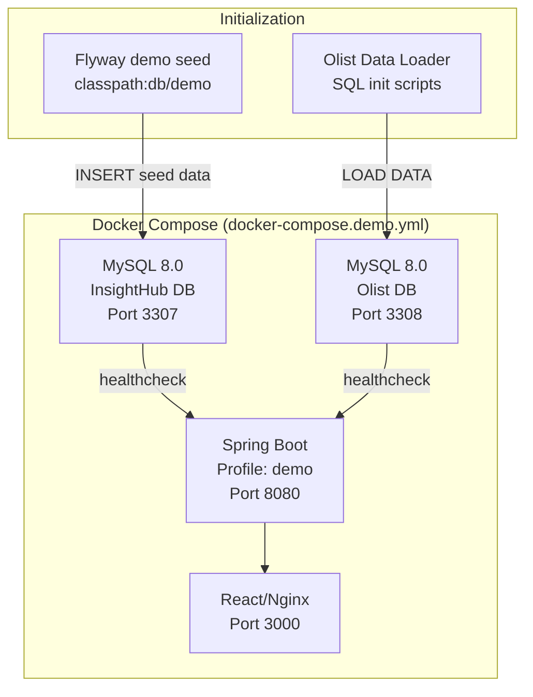

# Design Document: Olist Demo Setup

## Overview

This design provides a turnkey demo environment for InsightHub, powered by the Olist Brazilian E-commerce Public Dataset. The environment uses Docker Compose to orchestrate two MySQL 8.0 containers (one for InsightHub metadata, one for the Olist dataset), the Spring Boot backend with a `demo` profile, and the React frontend. A Flyway-based seed migration populates demo divisions, report groups, user groups, users, datasources, reports, and dashboards — giving evaluators a fully functional BI platform experience out of the box.

The design introduces a new `Division` entity to the schema, a `demo` Spring Boot profile backed by MySQL, a custom Docker image for the Olist data loader, and Makefile targets for convenient lifecycle management.

## Architecture



**Startup sequence:**
1. Both MySQL containers start and run health checks (`mysqladmin ping`)
2. The Olist DB container runs `/docker-entrypoint-initdb.d/` scripts to create tables and load CSVs (first-run only)
3. The backend starts with `SPRING_PROFILES_ACTIVE=demo`, connects to `insighthub-demo-mysql`, runs Flyway migrations (including `db/demo` seed data)
4. The frontend starts after backend is healthy

## Components and Interfaces

### 1. Docker Compose Demo File (`docker/docker-compose.demo.yml`)

Orchestrates four services:

| Service | Image | Ports | Depends On |
|---------|-------|-------|------------|
| `insighthub-demo-mysql` | `mysql:8.0` | `3307:3306` | — |
| `olist-mysql` | Custom (Dockerfile builds with CSV + init SQL) | `3308:3306` | — |
| `backend` | InsightHub backend | `8080:8080` | Both MySQL (healthy) |
| `frontend` | InsightHub frontend | `3000:80` | backend |

**Environment variables:**
- `MYSQL_ROOT_PASSWORD`, `MYSQL_DATABASE`, `MYSQL_USER`, `MYSQL_PASSWORD` for both MySQL containers
- `DEMO_DATA_VERSION` on `olist-mysql` — changing it invalidates the volume, forcing a reload
- `SPRING_PROFILES_ACTIVE=demo` on backend

### 2. Olist Data Loader (`demo/olist-db/`)

A custom Dockerfile that extends `mysql:8.0`:
- Copies the 9 Olist CSV files into the image at `/data/`
- Copies `01-schema.sql` and `02-load-data.sql` into `/docker-entrypoint-initdb.d/`
- MySQL's entrypoint automatically runs these scripts on first boot (when the data volume is empty)

**`01-schema.sql`** creates:
- `olist_orders` (order_id PK, customer_id, order_status, purchase_timestamp, etc.)
- `olist_order_items` (order_id, order_item_id, product_id, seller_id, price, freight)
- `olist_order_payments` (order_id, payment_sequential, payment_type, payment_value)
- `olist_order_reviews` (review_id, order_id, review_score, comment_title, comment_message)
- `olist_customers` (customer_id PK, customer_unique_id, zip_code, city, state)
- `olist_products` (product_id PK, product_category_name, dimensions, weight)
- `olist_sellers` (seller_id PK, zip_code, city, state)
- `olist_geolocation` (zip_code, lat, lng, city, state)
- `product_category_name_translation` (category_name, category_name_english)

Indexes on: `order_id`, `customer_id`, `product_id`, `seller_id`, `order_status`, `order_purchase_timestamp`.

**`02-load-data.sql`** uses `LOAD DATA LOCAL INFILE` to bulk-import each CSV.

### 3. Spring Boot Demo Profile (`application-demo.yml`)

```yaml
spring:
  datasource:
    url: jdbc:mysql://insighthub-demo-mysql:3306/insighthub
    username: insighthub
    password: ${MYSQL_PASSWORD:insighthub}
    driver-class-name: com.mysql.cj.jdbc.Driver
  h2:
    console:
      enabled: false
  jpa:
    hibernate:
      ddl-auto: validate
    properties:
      hibernate:
        dialect: org.hibernate.dialect.MySQLDialect
  flyway:
    enabled: true
    locations: classpath:db/migration,classpath:db/demo
    baseline-on-migrate: true
```

### 4. Division Entity and Migration

A new `divisions` table and `DivisionEntity` class:

```sql
CREATE TABLE divisions (
    id          BIGINT AUTO_INCREMENT PRIMARY KEY,
    name        VARCHAR(100) NOT NULL UNIQUE,
    description VARCHAR(200),
    created_at  TIMESTAMP DEFAULT CURRENT_TIMESTAMP,
    updated_at  TIMESTAMP DEFAULT CURRENT_TIMESTAMP
);

-- Add division_id FK to report_groups
ALTER TABLE report_groups ADD COLUMN division_id BIGINT;
ALTER TABLE report_groups ADD CONSTRAINT fk_rg_division 
    FOREIGN KEY (division_id) REFERENCES divisions(id);

-- Add division_id FK to users
ALTER TABLE users ADD COLUMN division_id BIGINT;
ALTER TABLE users ADD CONSTRAINT fk_user_division 
    FOREIGN KEY (division_id) REFERENCES divisions(id);
```

### 5. Flyway Demo Seed Migration (`db/demo/`)

A versioned migration file (`V100__demo_seed_data.sql`) that runs only when the `demo` profile is active (via the `locations` config):

- Inserts 4 divisions
- Inserts 8 report groups (mapped to divisions)
- Inserts 5 user groups with appropriate roles
- Inserts 6 demo users with BCrypt passwords
- Inserts 1 datasource ("Olist E-commerce")
- Inserts 16+ reports with SQL queries
- Inserts 3 dashboards with dashboard items
- Inserts access rights (user_group_report_group_rights)

### 6. Olist CSV Download Script (`demo/download-olist-data.sh`)

A bash script that:
- Downloads the Olist dataset from Kaggle (requires `kaggle` CLI or direct URL)
- Extracts and places 9 CSV files into `demo/data/`
- Validates all 9 files exist
- Exits non-zero on failure

### 7. Makefile Targets

```makefile
.PHONY: demo-up demo-down demo-reset demo-logs

demo-up:     ## Start demo environment
demo-down:   ## Stop demo environment
demo-reset:  ## Reset demo (destroy volumes and restart)
demo-logs:   ## Stream demo container logs
```

## Data Models

### Division Entity (New)

```java
@Entity
@Table(name = "divisions")
public class DivisionEntity {
    Long id;
    String name;          // max 100, unique
    String description;   // max 200
    LocalDateTime createdAt;
    LocalDateTime updatedAt;
}
```

### Existing Entity Modifications

**ReportGroupEntity** — add:
```java
@ManyToOne(fetch = FetchType.LAZY)
@JoinColumn(name = "division_id")
private DivisionEntity division;
```

**UserEntity** — add:
```java
@ManyToOne(fetch = FetchType.LAZY)
@JoinColumn(name = "division_id")
private DivisionEntity division;
```

### Demo Seed Data Summary

| Entity | Count | Key Details |
|--------|-------|-------------|
| Divisions | 4 | Executive, Sales & Marketing, Operations & Logistics, Customer Success |
| Report Groups | 8 | Mapped to divisions per Req 5.2 |
| User Groups | 5 | Each with specific role permissions per Req 6.2 |
| Users | 6 | admin, ceo, sales_mgr, ops_lead, support_agent, analyst |
| Datasource | 1 | "Olist E-commerce" pointing to olist-mysql:3306 |
| Reports | 16+ | Mix of tabular (type=0) and chart (type=1) |
| Dashboards | 3 | Executive Overview, Sales Performance, Operations Monitor |
| Dashboard Items | 9+ | Min 3 per dashboard |

### Olist Database Schema (External)

| Table | Primary Key | Row Count |
|-------|-------------|-----------|
| olist_orders | order_id | ~99k |
| olist_order_items | order_id + order_item_id | ~113k |
| olist_order_payments | order_id + payment_sequential | ~103k |
| olist_order_reviews | review_id | ~100k |
| olist_customers | customer_id | ~99k |
| olist_products | product_id | ~33k |
| olist_sellers | seller_id | ~3k |
| olist_geolocation | zip_code + lat + lng | ~1M |
| product_category_name_translation | category_name | ~71 |


## Error Handling

### Database Container Failures

| Scenario | Handling |
|----------|----------|
| MySQL fails health check after retries | Docker Compose prevents dependent services from starting (dependency `condition: service_healthy`) |
| Olist data loading fails (bad CSV) | Init script uses `SET sql_mode = 'STRICT_ALL_TABLES'`; any error causes `mysql` entrypoint to exit non-zero, marking container unhealthy |
| Flyway migration failure | Backend exits with non-zero code; container marked unhealthy |

### Backend Startup Failures

| Scenario | Handling |
|----------|----------|
| Cannot connect to InsightHub MySQL | Spring Boot fails to start (datasource initialization failure), container exits |
| Cannot connect to Olist datasource | `DatabaseConnectionVerifier` retries 3 times at 5s intervals; after failure, logs error and throws `ApplicationContextException` preventing startup |
| Missing demo seed data (division with no users) | Validation bean at startup queries divisions and asserts invariants; fails fast with descriptive error |

### Data Loading Safeguards

| Scenario | Handling |
|----------|----------|
| Volume already has data | MySQL entrypoint skips `/docker-entrypoint-initdb.d/` when datadir is non-empty — standard MySQL behavior |
| Missing CSV files in image build | Dockerfile `COPY` fails at build time if files are absent |
| Download script network failure | Script checks HTTP status, exits non-zero with message |
| `DEMO_DATA_VERSION` changed | User must `down -v` to clear volume, then `up` to re-initialize |

### Graceful Degradation

- The demo environment is self-contained — failure in one container does not corrupt persistent volumes
- `demo-reset` Makefile target provides a clean recovery path (destroys volumes and rebuilds)
- All seed data is idempotent via Flyway versioned migrations (never re-applied)

## Correctness Properties

This feature is composed of infrastructure configuration (Docker Compose), declarative data seeding (Flyway SQL migrations), and shell scripts — none of which involve pure functions with variable inputs where universal properties can be asserted. Instead, correctness is defined by invariants validated through integration and smoke tests:

### Property 1: Container Health Invariant

All 4 Docker services reach healthy state within 5 minutes of `docker compose up`.

**Validates: Requirements 1.5, 10.2**

### Property 2: Data Completeness Invariant

Olist database contains ≥99k orders, ≥96k customers, ≥32k products, ≥3k sellers after initialization.

**Validates: Requirements 2.4**

### Property 3: Seed Data Integrity Invariant

Every division has ≥1 user and ≥1 report group; every report group has ≥2 reports; every dashboard has ≥3 items.

**Validates: Requirements 4.2, 4.3, 5.3, 12.2**

### Property 4: Authentication Invariant

For each demo user U, `BCrypt.matches(U.username, U.password_hash) == true`.

**Validates: Requirements 7.2**

### Property 5: Report Executability Invariant

Every demo report's SQL executes without error against the Olist database and returns ≥1 row.

**Validates: Requirements 9.3**

### Property 6: Access Differentiation Invariant

At least 2 user groups have non-overlapping report group access sets.

**Validates: Requirements 6.4**

## Testing Strategy

### Why Property-Based Testing Does NOT Apply

This feature consists of:
- **Docker Compose orchestration** (IaC / infrastructure configuration)
- **Flyway SQL seed migrations** (one-time data insertion, no transformation logic)
- **Spring Boot profile configuration** (declarative YAML)
- **Shell scripts** (download, Makefile targets)
- **Database initialization** (side-effect-only operations)

None of these involve pure functions with variable inputs where universal properties can be asserted across many generated inputs. The correctness of this feature is determined by:
1. Whether containers start and become healthy
2. Whether expected records exist in the database after initialization
3. Whether SQL queries execute without error against the Olist data

These are best validated with **integration tests** and **smoke tests**, not property-based tests.

### Integration Tests

| Test | What it validates |
|------|-------------------|
| Docker Compose up/health | All 4 services reach healthy state within 5 minutes (Req 10.2) |
| Olist table row counts | `olist_orders` ≥ 99k, `olist_customers` ≥ 96k, etc. (Req 2.4) |
| Datasource connectivity | Backend successfully executes `SELECT 1` against Olist datasource (Req 8.3) |
| Demo user login | Each of the 6 demo users can authenticate with username=password (Req 7.2) |
| Report execution | Each of the 16+ demo reports returns ≥ 1 row (Req 9.3) |
| Dashboard completeness | Each dashboard has ≥ 3 items referencing active reports (Req 12.2) |

### Smoke Tests

| Test | What it validates |
|------|-------------------|
| Frontend responds HTTP 200 at localhost:3000 | Req 10.3 |
| Backend responds HTTP 200 at localhost:8080/insighthub | Req 10.3 |
| MySQL ports exposed (3307, 3308) | Req 1.6 |
| Division count ≥ 4 | Req 4.1 |
| Report group count ≥ 8 | Req 5.1 |
| User group count ≥ 5 | Req 6.1 |

### Example-Based Unit Tests

| Test | What it validates |
|------|-------------------|
| BCrypt password encoding | `BCrypt.matches("ceo", storedHash)` returns true (Req 7.2) |
| Division-user assignment | Each division has ≥ 1 user (Req 4.2) |
| Division-report group assignment | Each division has ≥ 1 report group (Req 4.3) |
| User group role mapping | "Executive Team" has view_reports, view_analytics, view_jobs, view_logs (Req 6.2) |
| Access rights differentiation | ≥ 2 user groups have non-overlapping report group access (Req 6.4) |
| Report type distribution | ≥ 8 tabular + ≥ 4 chart reports (Req 9.4) |
| Executive Overview dashboard | Items reference ≥ 2 distinct report groups (Req 12.3) |

### Test Execution

- **Smoke tests**: Run via a shell script (`demo/smoke-test.sh`) after `demo-up` completes
- **Integration tests**: Run via Testcontainers in Maven test phase using a MySQL 8.0 container
- **Unit tests**: Standard JUnit 5 tests validating seed data SQL output (can run against H2 with MySQL compatibility mode or directly parse migration SQL)

### Test Coverage Map

| Requirement | Test Type |
|-------------|-----------|
| Req 1 (MySQL containers) | Smoke + Integration |
| Req 2 (Olist data loading) | Integration (row counts) |
| Req 3 (Demo profile) | Integration (backend starts) |
| Req 4 (Divisions) | Unit + Integration |
| Req 5 (Report groups) | Unit + Integration |
| Req 6 (User groups) | Unit + Integration |
| Req 7 (Users) | Unit + Integration |
| Req 8 (Datasource) | Integration |
| Req 9 (Reports) | Integration |
| Req 10 (Docker orchestration) | Smoke + Integration |
| Req 11 (Makefile) | Smoke (manual) |
| Req 12 (Dashboards) | Unit + Integration |
| Req 13 (CSV packaging) | Smoke (build-time) |
