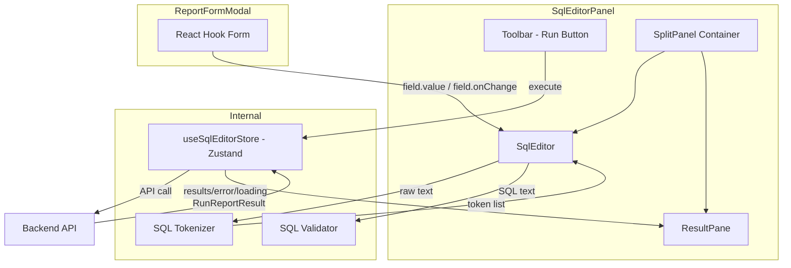

# Design Document: SQL Editor Panel

## Overview

The SQL Editor Panel replaces the basic `<textarea>` in `ReportFormModal.tsx` with a professional SQL editing experience. It comprises a custom lightweight syntax highlighter (no heavy third-party editor), client-side validation, a Run button for inline query execution, and a vertical split-panel layout that renders results in a scrollable table below the editor.

### Key Design Decisions

1. **Custom lightweight editor over CodeMirror/Monaco** — The feature scope (syntax highlighting, basic editing, no autocomplete/intellisense) does not justify the ~300KB+ bundle cost of Monaco or even the ~100KB cost of CodeMirror 6. A custom `contenteditable`-free approach using a hidden `<textarea>` overlaid with a highlighted `<pre>` layer provides sufficient functionality at a fraction of the bundle size and complexity.

2. **Tokenizer-based highlighting** — A simple state-machine tokenizer handles SQL keywords, strings, numbers, and comments. This runs synchronously on each keystroke (well under 100ms for ≤5000 chars).

3. **Zustand store for editor execution state** — Query execution state (loading, results, errors) lives in a local Zustand store scoped to the editor panel, keeping React Hook Form responsible only for the `reportSource` field value.

4. **Existing `runReport` API reuse** — The backend already exposes `POST /reports/{id}/run`. For unsaved reports, we introduce a new `POST /reports/run-adhoc` endpoint concept that accepts raw SQL + datasource ID. The design assumes this endpoint exists or will be created.

5. **CSS-based split panel with drag handle** — No library needed; a simple flex layout with a draggable divider handles resizing via pointer events.

## Architecture



## Components and Interfaces

### File Structure

```
src/features/reports/sql-editor/
├── SqlEditorPanel.tsx        # Top-level container (toolbar + split panel)
├── SqlEditor.tsx             # Textarea + highlight overlay + line numbers
├── SqlTokenizer.ts           # Tokenizer: string → Token[]
├── SqlValidator.ts           # Validation: string → ValidationError[]
├── ResultPane.tsx            # Result table or error display
├── SplitPanel.tsx            # Vertical split with drag handle
├── ErrorDisplay.tsx          # Error rendering component
├── useSqlEditorStore.ts      # Zustand store for execution state
├── sql-editor.types.ts       # Shared TypeScript types
└── __tests__/
    ├── SqlTokenizer.test.ts
    ├── SqlValidator.test.ts
    └── SqlEditorPanel.test.tsx
```

### Component Interfaces

#### `SqlEditorPanel`

```typescript
interface SqlEditorPanelProps {
  /** React Hook Form control object */
  control: Control<FormData>;
  /** Name of the form field (always 'reportSource') */
  name: 'reportSource';
  /** Selected datasource ID from the form */
  datasourceId: number | null;
  /** Report ID (for saved reports, enables runReport API) */
  reportId?: number;
}
```

Top-level orchestrating component. Renders the toolbar, editor, and result pane inside a `SplitPanel`. Connects the `SqlEditor` to React Hook Form via `useController`.

#### `SqlEditor`

```typescript
interface SqlEditorProps {
  value: string;
  onChange: (value: string) => void;
  placeholder?: string;
  minHeight?: number;
  'aria-label'?: string;
}
```

The core editing surface. Renders a hidden `<textarea>` for input capture (preserving native undo/redo, clipboard, IME) and an overlaid `<pre><code>` block that displays the tokenized, highlighted output. Line numbers render in a left gutter `<div>`.

**Keyboard handling:**
- Tab → inserts 2 spaces (prevents focus escape)
- Escape → disables Tab trapping (next Tab moves focus)
- Ctrl/Cmd+Enter → calls `onExecute` prop
- Ctrl/Cmd+Z / Ctrl/Cmd+Shift+Z → native textarea undo/redo (≥50 operations)

#### `SqlTokenizer`

```typescript
type TokenType = 'keyword' | 'string' | 'number' | 'comment' | 'default';

interface Token {
  type: TokenType;
  value: string;
}

function tokenize(sql: string): Token[];
```

A pure function. State-machine tokenizer that scans input character-by-character, handling:
- SQL keywords (case-insensitive match against a set)
- Single-quoted strings (with `''` escape)
- Numeric literals (integers, decimals, scientific notation)
- Single-line comments (`--`)
- Multi-line comments (`/* ... */`)
- Everything else → `default`

#### `SqlValidator`

```typescript
interface ValidationError {
  type: 'empty' | 'unbalanced-parentheses' | 'unclosed-string';
  message: string;
}

function validateSql(sql: string): ValidationError[];
```

A pure function. Performs three structural checks:
1. Empty/whitespace-only → `"SQL query cannot be empty"`
2. Unmatched parentheses (counts `(` and `)` outside strings/comments) → `"Unbalanced parentheses"`
3. Unclosed string literal (odd number of unescaped `'` outside comments) → `"Unclosed string literal"`

Returns all applicable errors simultaneously.

#### `useSqlEditorStore`

```typescript
interface SqlEditorState {
  isExecuting: boolean;
  result: RunReportResult | null;
  error: string | null;
  validationErrors: ValidationError[];

  execute: (sql: string, datasourceId: number, reportId?: number) => Promise<void>;
  setValidationErrors: (errors: ValidationError[]) => void;
  clearResults: () => void;
}
```

Zustand store managing execution lifecycle. The `execute` action:
1. Clears previous results/errors
2. Sets `isExecuting = true`
3. Calls backend API
4. On success: stores `RunReportResult`, sets `isExecuting = false`
5. On error: stores error message, sets `isExecuting = false`

#### `SplitPanel`

```typescript
interface SplitPanelProps {
  topContent: React.ReactNode;
  bottomContent: React.ReactNode;
  initialTopRatio?: number; // default 0.6 (60% editor, 40% results)
  minTopHeight?: number;    // default 200px
  minBottomHeight?: number; // default 100px
}
```

Flexbox-based vertical splitter with a draggable handle. Uses `onPointerDown`/`onPointerMove`/`onPointerUp` for resize tracking. Persists ratio in component state (not global).

#### `ResultPane`

```typescript
interface ResultPaneProps {
  isLoading: boolean;
  result: RunReportResult | null;
  error: string | null;
}
```

Renders one of four states:
1. **Idle** — placeholder message "Run a query to see results"
2. **Loading** — spinner + "Executing query..."
3. **Success** — metadata bar (row count • execution time) + scrollable table
4. **Error** — `ErrorDisplay` component

#### `ErrorDisplay`

```typescript
interface ErrorDisplayProps {
  message: string;
  type: 'validation' | 'execution';
}
```

Renders error with:
- Red background/border styling
- `role="alert"` and `aria-live="assertive"` for screen reader announcement
- Full text up to 500 chars; "Show more" toggle for longer messages

### API Integration

For **saved reports**, use existing `runReport(reportId, params)`.

For **unsaved/ad-hoc execution**, the panel needs a new endpoint:

```typescript
export async function runAdHocQuery(
  datasourceId: number,
  sql: string,
): Promise<RunReportResult> {
  const { data } = await apiClient.post('/reports/run-adhoc', {
    datasourceId,
    sql,
  });
  return data;
}
```

The `execute` action in the store decides which API to call based on whether `reportId` is provided.

## Data Models

### Token Types

```typescript
// SQL token categories for syntax highlighting
type TokenType = 'keyword' | 'string' | 'number' | 'comment' | 'default';

interface Token {
  type: TokenType;
  value: string;
}
```

### Validation Errors

```typescript
type ValidationErrorType = 'empty' | 'unbalanced-parentheses' | 'unclosed-string';

interface ValidationError {
  type: ValidationErrorType;
  message: string;
}
```

### Execution State

```typescript
// Re-uses existing type from api.ts
interface RunReportResult {
  columns: string[];
  rows: Record<string, unknown>[];
  rowCount: number;
  executionMs: number;
}
```

### Editor Configuration

```typescript
interface SqlEditorConfig {
  keywords: Set<string>;          // SQL keyword set for tokenizer
  maxHighlightLength: number;     // 5000 chars
  tabSize: number;                // 2 spaces
  minHeight: number;              // 200px
  maxUndoHistory: number;         // 50 operations
  maxErrorDisplayLength: number;  // 500 chars
  cellTruncateLength: number;     // 200 chars
}
```


## Correctness Properties

*A property is a characteristic or behavior that should hold true across all valid executions of a system — essentially, a formal statement about what the system should do. Properties serve as the bridge between human-readable specifications and machine-verifiable correctness guarantees.*

### Property 1: Tokenizer completeness (round-trip)

*For any* SQL string, the concatenation of all token `value` fields returned by `tokenize(sql)` SHALL equal the original input string exactly — no characters are lost or added during tokenization.

**Validates: Requirements 1.1, 1.2, 1.3, 1.4, 1.7**

### Property 2: Keyword classification (case-insensitive)

*For any* SQL keyword from the defined keyword set and *for any* casing variant of that keyword (uppercase, lowercase, mixed), `tokenize(keyword)` SHALL produce exactly one token with `type: 'keyword'`.

**Validates: Requirements 1.1**

### Property 3: Literal classification

*For any* valid single-quoted string literal (including those with `''` escaped quotes), `tokenize` SHALL produce a token with `type: 'string'`. *For any* valid numeric literal (integer, decimal, scientific notation), `tokenize` SHALL produce a token with `type: 'number'`. *For any* valid comment (single-line `--` or multi-line `/* */`), `tokenize` SHALL produce a token with `type: 'comment'`.

**Validates: Requirements 1.2, 1.3, 1.4**

### Property 4: Empty/whitespace validation

*For any* string composed entirely of whitespace characters (spaces, tabs, newlines, or the empty string), `validateSql` SHALL return an error array containing an error of type `'empty'` with message `"SQL query cannot be empty"`.

**Validates: Requirements 2.2**

### Property 5: Parenthesis balance validation

*For any* SQL string where the count of `(` characters outside string literals and comments differs from the count of `)` characters outside string literals and comments, `validateSql` SHALL return an error of type `'unbalanced-parentheses'`.

**Validates: Requirements 2.3**

### Property 6: Unclosed string validation

*For any* SQL string containing an odd number of unescaped single-quote characters outside of comments, `validateSql` SHALL return an error of type `'unclosed-string'`.

**Validates: Requirements 2.4**

### Property 7: Result table column rendering

*For any* `RunReportResult` with an arbitrary list of column names, the ResultPane table SHALL render header cells whose text content matches each column name in order.

**Validates: Requirements 4.2**

### Property 8: Cell value formatting

*For any* cell value, if the string representation exceeds 200 characters the displayed text SHALL be the first 200 characters followed by `'…'`. *For any* null cell value, the displayed text SHALL be `'—'`.

**Validates: Requirements 4.3**

### Property 9: Error message truncation

*For any* error message string, if its length is ≤ 500 characters the ErrorDisplay SHALL render the full text. If its length exceeds 500 characters, the ErrorDisplay SHALL render only the first 500 characters with a "Show more" control that reveals the full text when activated.

**Validates: Requirements 5.4**

## Error Handling

### Client-Side Errors

| Error Condition | Handling |
|----------------|----------|
| Empty SQL (validation) | Inline error below editor: "SQL query cannot be empty". Run button blocked. |
| Unbalanced parentheses | Inline error: "Unbalanced parentheses". Run button blocked. |
| Unclosed string literal | Inline error: "Unclosed string literal". Run button blocked. |
| No datasource selected | Run button disabled with tooltip: "Select a datasource to run queries". |
| Multiple validation errors | All errors displayed simultaneously in a list below the editor. |

### Server-Side Errors

| Error Condition | Handling |
|----------------|----------|
| Backend returns error response (4xx/5xx) | Error message from `response.data.message` or generic "Query execution failed" displayed in ErrorDisplay within ResultPane. Previous results cleared. |
| Network/connection failure (no response) | ErrorDisplay shows "Unable to reach the server. Check your connection and try again." Previous results cleared. |
| Request timeout (>30s via Axios default) | Same as network failure handling. |

### Error State Transitions

1. **Validation error → user fixes issue** → error clears within 200ms (debounced `onChange` re-validates)
2. **Execution error → new execution** → previous error cleared before new request starts
3. **Execution error → user edits SQL** → error persists until next execution (execution errors are not auto-cleared on edit)

### Accessibility for Errors

- All error containers use `role="alert"` or `aria-live="assertive"` so screen readers announce errors immediately.
- Validation errors appear directly below the editor (not in the result pane) for spatial proximity to the input.
- Execution errors appear in the result pane with red styling (`bg-red-50 border-red-200 text-red-800`).

## Testing Strategy

### Unit Tests (Example-Based)

Unit tests cover specific examples, edge cases, and integration points:

- **SqlTokenizer**: Known SQL snippets produce expected token sequences (e.g., `SELECT * FROM users` → keyword, default, keyword, default)
- **SqlValidator**: Specific invalid inputs produce correct error types
- **ResultPane**: Renders correct states (idle, loading, success, error, empty results)
- **SqlEditorPanel**: Integration with React Hook Form (value sync, dirty state)
- **Keyboard handling**: Tab inserts spaces, Escape releases focus trap, Ctrl+Enter triggers execution
- **Accessibility**: aria-label present, role="alert" on errors

### Property-Based Tests

Property tests use **[fast-check](https://github.com/dubzzz/fast-check)** (already compatible with Vitest) to verify universal properties across randomized inputs.

**Configuration:**
- Minimum 100 iterations per property test
- Each test tagged with: `Feature: sql-editor-panel, Property {N}: {title}`

**Properties to implement:**

1. **Tokenizer completeness** — Generate random strings (including SQL-like content), verify `tokenize(s).map(t => t.value).join('') === s`
2. **Keyword classification** — Generate random keyword from set + random casing, verify token type
3. **Literal classification** — Generate random string/number/comment literals, verify token types
4. **Empty validation** — Generate whitespace-only strings, verify 'empty' error returned
5. **Parenthesis balance** — Generate strings with deliberate imbalance, verify error
6. **Unclosed string** — Generate strings with odd quote counts, verify error
7. **Column rendering** — Generate random column name arrays, verify header text matches
8. **Cell formatting** — Generate random strings of varying lengths + nulls, verify truncation/null display
9. **Error truncation** — Generate strings of varying lengths, verify display behavior at 500-char boundary

### Test File Organization

```
src/features/reports/sql-editor/__tests__/
├── SqlTokenizer.test.ts          # Unit + property tests for tokenizer
├── SqlValidator.test.ts          # Unit + property tests for validator
├── SqlEditorPanel.test.tsx       # Integration tests for panel component
├── ResultPane.test.tsx           # Unit tests for result rendering
├── ErrorDisplay.test.tsx         # Unit + property tests for error display
└── formatCell.test.ts            # Property tests for cell formatting
```

### Integration Tests

- Full editor panel mounted with React Hook Form context, verifying:
  - Form submission includes `reportSource` value
  - Edit mode populates existing value
  - Run button triggers API call with correct parameters
  - Loading and error states propagate correctly
